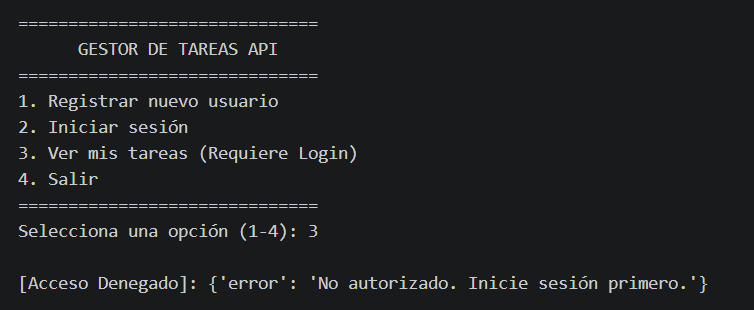
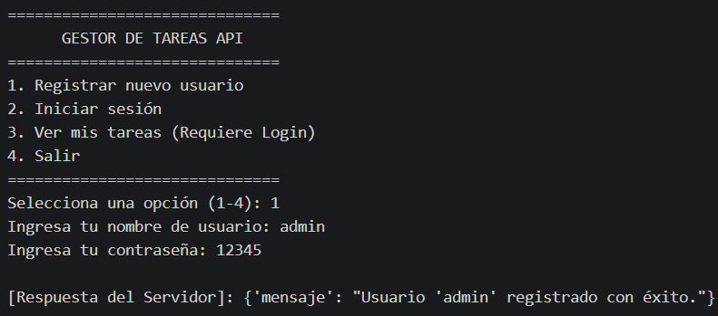
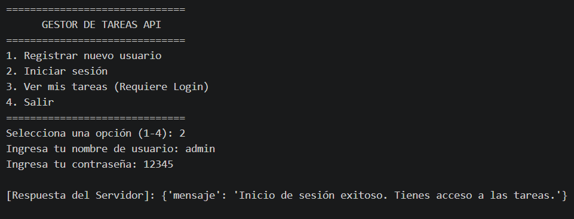
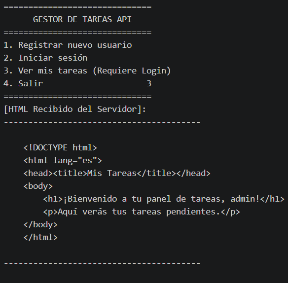
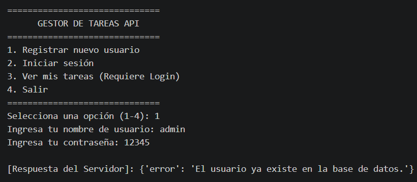
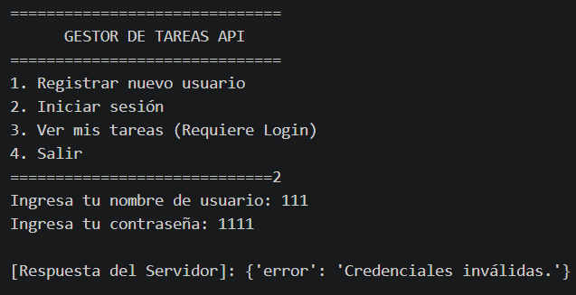
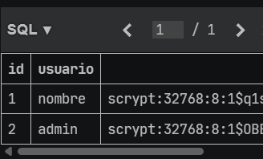

# Gestor de tareas API

API sencilla para registrar usuarios, iniciar sesión y consultar un panel de tareas. El servidor está desarrollado con Flask, guarda los usuarios en SQLite y el cliente de consola conserva la cookie de sesión durante su ejecución.

## Requisitos

- Python 3 instalado.
- Dos terminales para ejecutar el servidor y el cliente al mismo tiempo.

## Instalación

Desde la carpeta del proyecto, crea y activa un entorno virtual:

```powershell
py -m venv .venv
.\.venv\Scripts\Activate.ps1
```

Instala las dependencias:

```powershell
pip install Flask requests
```

Si PowerShell impide activar el entorno virtual, permite la activación solo para la terminal actual y vuelve a intentarlo:

```powershell
Set-ExecutionPolicy -Scope Process -ExecutionPolicy Bypass
.\.venv\Scripts\Activate.ps1
```

## Ejecutar el proyecto

1. En la primera terminal, activa el entorno virtual si todavía no está activo y ejecuta el servidor:

   ```powershell
   python servidor.py
   ```

   El servidor inicia en `http://127.0.0.1:5000` y crea la tabla de usuarios en `database.db` si aún no existe. Mantén esta terminal abierta.

2. En una segunda terminal, desde la misma carpeta, activa el entorno virtual y ejecuta el cliente:

   ```powershell
   .\.venv\Scripts\Activate.ps1
   python cliente.py
   ```

   El cliente mostrará un menú con las opciones para registrar un usuario, iniciar sesión y consultar las tareas.

## Probar el funcionamiento

Se puede verificar el flujo manualmente desde el cliente:

1. **Acceso sin iniciar sesión:** elige `3`. La respuesta esperada es `401` con el mensaje `No autorizado. Inicie sesión primero.`
2. **Registro:** elige `1` e ingresa un nombre de usuario nuevo y una contraseña. Debe aparecer el mensaje `registrado con éxito`.
3. **Inicio de sesión:** elige `2` e ingresa las mismas credenciales. Debe aparecer `Inicio de sesión exitoso`.
4. **Consulta de tareas:** elige `3` nuevamente. La respuesta debe ser `200` y mostrar el HTML con el saludo `¡Bienvenido a tu panel de tareas, <usuario>!`.
5. **Usuario duplicado:** vuelve a registrar el mismo nombre de usuario. La API debe responder que el usuario ya existe.
6. **Salir:** elige `4` para cerrar el cliente.

El inicio de sesión y la consulta de tareas deben hacerse en la misma ejecución del cliente, porque la sesión se mantiene mediante una cookie guardada por `requests.Session`.

## Capturas de pruebas exitosas


### Acceso sin iniciar sesión


### Registro exitoso


### Inicio de sesión exitoso


### Consulta de tareas exitosa


### Registro de usuario duplicado


### Inicio de sesión -  credenciales inválidas


### Usuarios en SQLite con contraseñas hasheadas
